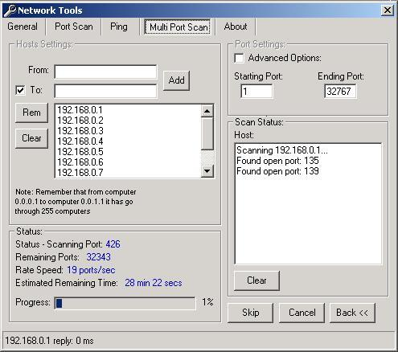



## Network Tools 0\.4 beta

### Description

NetTools is a program that a little package that includes PortScan and Ping on a Single or Multiple network, with both simple and advanced options, usefull for seaching a trojan in your LAN, it's user friendly, and has an intuitive disign, it also includes a little BAS that you may find usefull. Comments are greatly apreciated! Next update will have an INI, a little database for maximum control of portscan and if you send any post any adition that i forgot. Please try it it's a good piece of coding anyways^_^!
 
### More Info
 

             |
---                |---
**Submitted On**   |2001-07-23 20:39:48
**By**             |[Tiago Cogumbreiro](https://github.com/Planet-Source-Code/PSCIndex/blob/master/ByAuthor/tiago-cogumbreiro.md)
**Level**          |Intermediate
**User Rating**    |5.0 (10 globes from 2 users)
**Compatibility**  |VB 6\.0
**Category**       |[Internet/ HTML](https://github.com/Planet-Source-Code/PSCIndex/blob/master/ByCategory/internet-html__1-34.md)
**World**          |[Visual Basic](https://github.com/Planet-Source-Code/PSCIndex/blob/master/ByWorld/visual-basic.md)
**Archive File**   |[Network To233447232001\.zip](https://github.com/Planet-Source-Code/tiago-cogumbreiro-network-tools-0-4-beta__1-25385/archive/master.zip)

